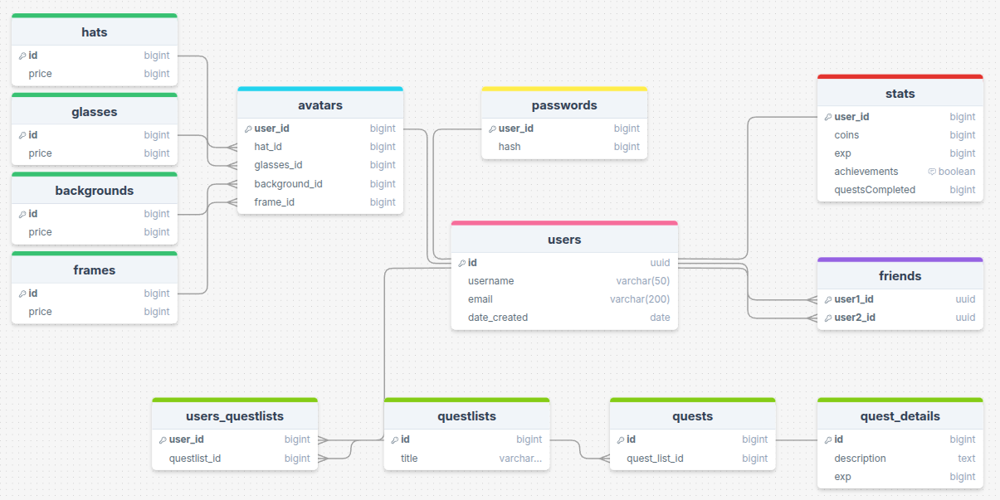

# Questify
## Co to jest?
Questify to aplikacja pozwalająca użytkownikom na organizację ich zadań, motywując ich do podążania za swoimi celami!
## Features
- Twórz interaktywne listy zadań
- Dodaj swoich znajomych
- Zmieniaj swój awatar za pomocą waluty z wykonywania zadań
- Podziel się swoim progresem z innymi!
- Zbieraj QuestCoins za wykonywanie zadań i zdobywanie osiągnięć!

### Spełnienie wymagań projektowych: 

1. Opis aplikacji (powyżej)
2. Opis podziału pracy: 
    * Jan Nowacki
        * Całość backendu, z wyłączeniem autoryzacji
        * Dokumentacja projektu
        * Sporządzenie diagramu bazy danych
    * Daniel Stawicki
        * Całość frontendu
        * Autoryzacja użytkownika
        * Sporządzenie diagramu bazy danych
3. Opis + diagram bazy danych 

Baza relacyjna wykonana za pomocą PostgreSQL oraz Prisma ORM. 

